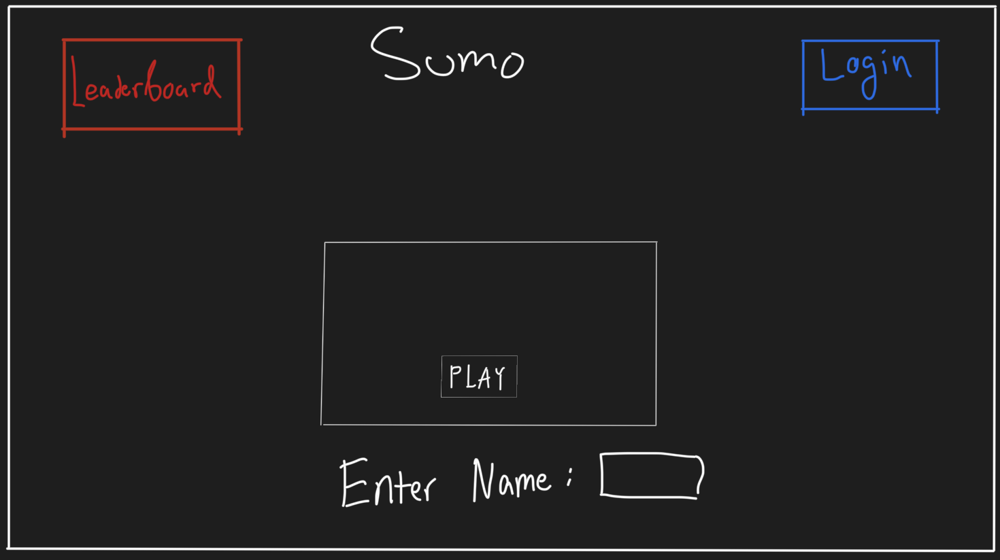
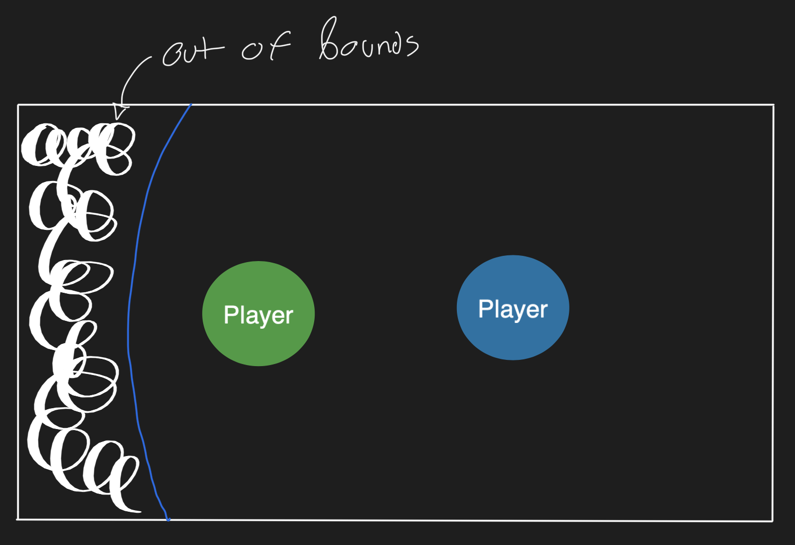
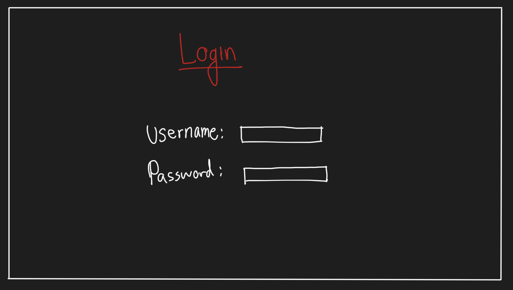
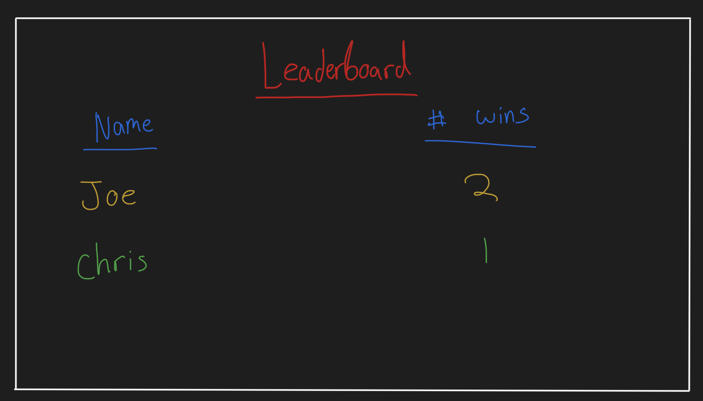

# Sumo.io - an IO style game

## Elevator Pitch
Often the casual gamer wants to play a game with his/her friends. In recent
years, the multiplayer game sector has exploded and lead to the birth of many
simple online multiplayer games. I am proposing a new IO game called Sumo.
Players will spawn inside a "Sumo Ring" and will fight to push other players out
of the ring to become the champion. Players will authenticate with an account
and will be able to have stats associated with their accounts. A global
leaderboard will be public and players will compete to dominate the leaderboard.

## Design
I propose the following design for the website:

## Key Features
- Secure login over HTTPS
- Ability to choose player color
- Global leaderboard of the Players with the most wins
- Ability to change player display name
- Wins are automatically synced with player accounts.

## Technologies
- HTML - Uses correct HTML practices for the structure of the application. I will have the following pages: home, login, game, leaderboard
- CSS - Application styling that dynamically reacts to screens of different sizes and makes it possible for all devices to interact with the application.
- React - Allows for dynamic interaction with the login, leaderboard, and home pages
- Service - Backend service with endpoints for:
    - Login
    - Retrieving and sending of game data
    - Leaderboard data
- DB/Login - Stores user information including their passwords and player statistics
- WebSocket - Each client will send their movements over WebSocket to the server. The server will respond by sending opponenent movements to the client for rendering.

## 🚀 HTML deliverable

For this deliverable I did the following. I checked the box `[x]` and added a description for things I completed.

- [x] **HTML pages** - Five different pages. One for each view. `index.html` (home), `game.html`, `leaderboard.html`, `register.html` and `login.html`.
- [x] **Proper HTML element usage** - I spent a lot of time learning about elements. I used header, footer, main, nav, a, input, form.
- [x] **Links** - Links between views.
- [x] **Text** - Leaderboard page has text
- [x] **3rd party API placeholder** - Index page has a welcome from with a placeholder for the user's country to be filled by an api call 
- [x] **Images** - Image is displayed on the game page.
- [x] **Login placeholder** - Placeholder for auth on the login page.
- [x] **DB data placeholder** - High scores displayed on leaderboard page.
- [x] **WebSocket placeholder** - The game page has an image of what the game will look like. Game communication done through websockets

## 🚀 CSS deliverable

- [x] **Header, footer, and main content body** - I used a common CSS file to style these `style.css` along with the bootstrap style sheet. 
- [x] **Navigation elements** - Bootstrap NavBar.
- [x] **Responsive to window resizing** - Bootstrap and `display:flex' did most the work here. I'm really happy with the game rendering.
- [x] **Application elements** - I used a lot of bootstrap grid
- [x] **Application text content** - I used bootstrap fonts and it looks dope.
- [x] **Application images** - I used an SVG image of the github logo as my link to my repo & I have an image at the game.html endpoint

## 🚀 React part 1: Routing deliverable

- [x] **Bundled using Vite** - Easy to install and use Vite.
- [x] **Components** - Major html elements are now inside components
- [x] **Router** - Routing implemented with React Router

## 🚀 React part 2: Interactivity

- [x] **All functionality implemented** - All pages use endpoints on the server & data is persisted between page loads via local storage.
- [x] **Hooks** - useEffect, useState, useContext are all used in the react app.

## 🚀 Service deliverable

- [x] **Node.js/Express HTTP service** - Installed Express with NPM. Default port on 4000.js.
- [x] **Static middleware for frontend** - Simple endpoints in `service` folder.
- [x] **Calls to third party endpoints** - Home page makes a call to 3rd party service that
returns the country code based upon the ip address of the user. 
- [x] **Backend service endpoints** - Simple endpoints in `service` folder. 
- [x] **Frontend calls service endpoints** - All mocked functionality removed from the frontend and replaced with calls to the service.
- [x] **Supports registration, login, logout, and restricted endpoint** - Fully support authentication and restrict access to user stats.

## 🚀 DB deliverable
- [x] **Stores data in MongoDB** - User credentials and data are stored in the database

## 🚀 Web Socket deliverable
- [x] **Game data over web socket** - All game data is coordinated over websockets at 60 times a second. This includes syncing the client state with the other client state and server state. 
