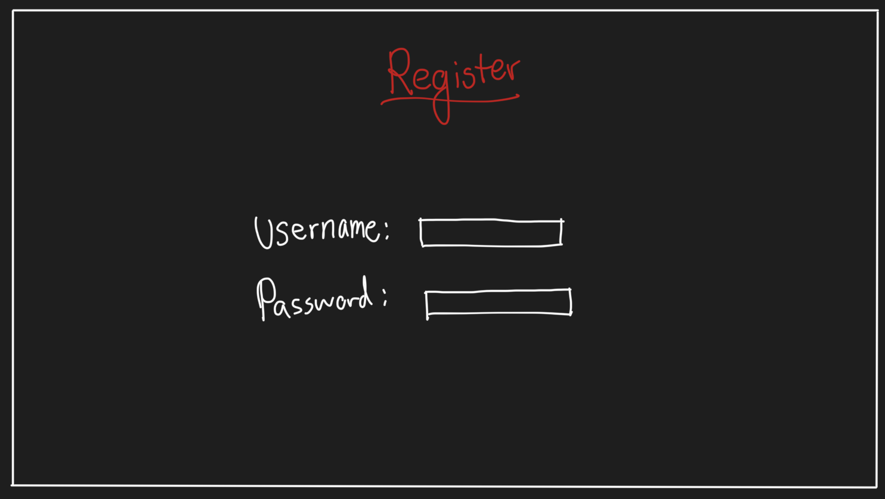

# Sumo.io - an IO style game

## Elevator Pitch
Often the casual gamer wants to play a game with his/her friends. In recent
years, the multiplayer game sector has exploded and lead to the birth of many
simple online multiplayer games. I am proposing a new IO game called Sumo.
Players will spawn inside a "Sumo Ring" and will fight to push other players out
of the ring to become the champion. Players will authenticate with an account
and will be able to have stats associated with their accounts. A global
leaderboard will be public and players will compete to dominate the leaderboard.

## Design
I propose the following design for the website:

## Key Features
- Secure login over HTTPS
- Ability to choose player color
- Global leaderboard of the Players with the most wins
- Ability to change player display name
- Wins are automatically synced with player accounts.

## Technologies
- HTML - Uses correct HTML practices for the structure of the application. I will have the following pages: home, login, game, leaderboard
- CSS - Application styling that dynamically reacts to screens of different sizes and makes it possible for all devices to interact with the application.
- React - Allows for dynamic interaction with the login, leaderboard, and home pages
- Service - Backend service with endpoints for:
    - Login
    - Retrieving and sending of game data
    - Leaderboard data
- DB/Login - Stores user information including their passwords and player statistics
- WebSocket - Each client will send their movements over WebSocket to the server. The server will respond by sending opponenent movements to the client for rendering.